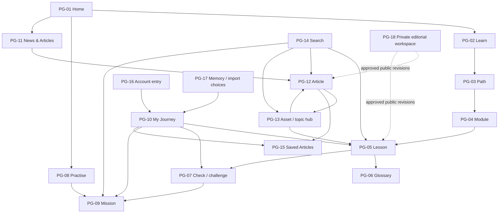

# Wetin Be Crypto — Sitemap and Functional Page Specification

Version: 0.2
Date: 7 October 2026
Status: P-03 draft for review under approved D-15. Page families, navigation, URLs, and detailed behaviour remain proposals.

## Purpose and scope

Define what people can find, what each page must communicate, and how learning, articles, subjects, and saved records relate. This is a functional specification, with a simple relationship diagram. It supplies no visual concepts, polished wireframes, mobile/desktop mockups, typography, colours, or visual component library.

Read [Feature Specification](FEATURE-SPECIFICATION.md), [Curriculum and Journeys](CURRICULUM-AND-JOURNEYS.md), and [Functional Flows](FUNCTIONAL-FLOWS.md) alongside this document. [Decision Log](DECISION-LOG.md) distinguishes approved policy from proposed details. Page-family IDs are stable references for planning; eighteen families do not imply eighteen WordPress pages or selected templates/plugins.

## Navigation proposal

| Entry | Destination and purpose | Access |
| --- | --- | --- |
| Home | Explain the learning promise; offer learning, reading, and available experienced-entry routes. | Public. |
| Learn | Foundation, published tracks, path/module overviews, and lessons. | Public reading; activity eligibility is separate. |
| Practise | Discover reviewed fictional missions and their preparation. | Guests and accounts can use eligible practice. |
| News & Articles | All, News, Explainers, and Stories; subject and materially applicable regional discovery. | Public. |
| Tools | Initially link to the public glossary. Add another tool only after its outcome and scope are approved. | Public; no empty promised tool catalogue. |
| My Journey | Available learning records, resume, next steps, and review. Link to Saved Articles for accounts. | Guests see current-browser records; accounts see their own confirmed records. |
| Search | Find published lessons, articles, hubs, glossary entries, available tools, and discoverable practice. | Public; excludes private learner/editorial records. |
| Account entry | Sign in, create an optional account, or recover access and return to the intended activity. | Optional for reading and guest practice; required for cross-device account saving/bookmarks. |

Coins and topics are relationship/discovery routes through articles, search, and hubs. A separate top-level Coins navigation item is not required by this proposal. Do not expose private editorial navigation to a public reader. Navigation labels and grouping require PD-04 review; this specifies destinations rather than their visual placement.

## Sitemap

An arrow indicates a possible relationship, not permission or automatic transition. For example, a mission still evaluates its declared prerequisites; Saved Articles still requires an account. Search and account entry are available across relevant public routes. PG-17 represents functional states that may be integrated into other pages.

## Page families and required information

Candidate URLs below illustrate relationships. PD-06 determines WordPress routing and permalinks; slugs are not approved canonical identifiers. Every published page needs a useful unavailable state if its referenced content is withdrawn. Publicly shared responses and unauthorised requests must not expose guest/account learner records or unpublished editorial material. Own account results require account authentication and ownership checks; own guest-session results require valid guest authority under the proposed technical mechanism. Editorial draft/review access requires the appropriate capabilities. Public lesson/article access never establishes permission to retrieve private records.

| ID / family | Candidate route | Information and actions | Key states / traceability |
| --- | --- | --- | --- |
| PG-01 — Home | `/` | Product purpose and audience; clear foundation, reading, and available challenge entry. A known journey may offer resume without inventing history. | New visitor; available resume; no approved challenge yet. FS-01/05/07; J-01/05/06. |
| PG-02 — Learn catalogue | `/learn/` | Published paths, levels, outcomes, and useful starting routes. Display available tracks rather than imply future specialist courses exist. | Foundation available; no published later track; unavailable referenced content. FS-01; J-01/05. |
| PG-03 — Path overview | `/learn/{path}/` | Purpose, edition, outcomes, recommended order, published modules, and available checks/practice. Explain that reading stays open. | Guest/no activity; partial activity; changed applicable requirements. FS-01/05; J-01/04. |
| PG-04 — Module overview | `/learn/{path}/{module}/` | Module outcomes, suggested preparation, available lessons, checks and missions, and their distinct record meanings. | Open reading; check available/unavailable; selected mission prerequisite unmet. FS-01/03/04/05. |
| PG-05 — Lesson | `/learn/lessons/{lesson}/` | Outcome, preparation, core English explanation, worked example, glossary, source/review context, explicit completion, and useful next step. | Unread/read position; completed; save pending/failed; material refresh recommended; optional media unavailable. FS-02/05/12; FL-01/04. |
| PG-06 — Glossary index / term | `/glossary/`, `/glossary/{term}/` | Published terms; clear definition, useful example, related learning, and return to the originating lesson where possible. | Term available; absent term offers available discovery; no registration gate or course credit. FS-02/09/12; FL-01/08. |
| PG-07 — Check / challenge | `/learn/checks/{activity}/` | Assessed outcomes, activity version, published criteria/essential decisions, instructions, attempt, result, explanatory feedback, and retry/revision routes. | Not started; in progress; pass/not yet pass; held for missing review/criteria; older attempt/current applicability; saving unresolved. FS-01/03/05; FL-02. |
| PG-08 — Practice catalogue | `/practise/` | Reviewed missions, task/outcomes, preparation, and eligibility context. Explain why a selected mission requires a check. | Eligible; prerequisites unmet; no reviewed mission for subject. Public lessons remain available. FS-04/09; FL-03/08. |
| PG-09 — Mission | `/practise/{mission}/` | Fictional task, mapped outcomes/rubric, prerequisite evidence, independent attempt, feedback, demonstrated result, and next step. | Eligible; missing/expired/currently inapplicable prerequisite; in progress; not demonstrated/demonstrated; activity paused; save pending/failed. FS-04/05; FL-03/04. |
| PG-10 — My Journey | `/my-journey/` | Last activity, useful next step, distinct completion/check/practice/review records, historical applicability, and saving scope/status. Account readers can reach Saved Articles. | Empty guest/account journey; current visit only; remembered on this browser; confirmed account records; changed totals; save failure. FS-05/06; FL-04/05/06/07. |
| PG-11 — News & Articles catalogue | `/articles/` | All/News/Explainers/Stories; meaningful format/date/subject labels; relevant regional filters; published coverage. | Selected filters; empty results; archive clearly labelled; no invented latest item. FS-07/09; FL-08. |
| PG-12 — Article | `/articles/{article}/` | Standalone original content, format, author, applicable subjects/regions, dates, supporting sources, corrections, and optional related reading/learning. Account Save/Unsave is separate from learning records. | Public reading; archive; materially updated/corrected; saved/unsaved/pending/failed; withdrawn. FS-07/10/11/12; FL-08/09/10. |
| PG-13 — Asset / topic hub | `/coins/{identity}/`, `/topics/{topic}/` | Reviewed introduction, canonical identity/aliases, limitations, sources/verification, and related published coverage/learning. | Useful introduction with or without current news; similar tickers disambiguated; insufficient reviewed content remains unpublished. FS-08/09; FL-08. |
| PG-14 — Search | `/search/` | Query, labelled content types/snippets, subject/type filters, maintained aliases, and ambiguity choices. A gated practice result names the missing check. | Results; no results with broader routes; ambiguous identity; filter selected. No private records, drafts, or unverified generated answers. FS-09; FL-08. |
| PG-15 — Saved Articles | `/saved-articles/` | One private account list referencing current public article records; open and Unsave actions. | Empty; saved; unsave pending/failed; identifiable withdrawn/unavailable item without draft content. FS-10; FL-09. |
| PG-16 — Account entry / recovery | Candidate account routes to be selected | Explain relevant account benefit; sign-in, optional registration, recovery, and return to the intended article/activity. Carry the declared save intent rather than lose it. | Successful; cancelled; failed; recovery pending; session ended; return content withdrawn. FS-06/10; FL-06/07/09. |
| PG-17 — Guest memory / import choices | Integrated state family; no separate URL required | Explain opt-in, 30-day scope, remove-memory action, existing-account import choice, reconciliation summary, and interrupted-operation recovery. | Declined; enabled; unavailable storage; expired/cleared; import accepted/declined/pending/failed. Never silently import shared-device activity. FS-06; FL-05/06/07. |
| PG-18 — Editorial workspace | Private administration/workflow route to be selected | Source records, revision-specific subject/editor approval, publication/update/correction status, dependencies, and emergency authority/audit. | Draft; missing sources/review; approved revision; substantive update pending; correction; affected assessment held. Capability enforcement remains a technical decision. FS-11; FL-10. |

PG-07, PG-09, and PG-17 are page/state families, not a promise that a particular LMS supplies them. Whether a check appears inside a lesson or at its own route is a component decision, provided outcomes, return paths, access, and state rules remain intact.

## Content and record relationships

| Relationship | Functional rule | Planning consequence |
| --- | --- | --- |
| Path → module → lesson | Recommended order provides orientation; selected practice gates are explicit outcome requirements. | Public lesson routes must support direct entry without enforcing course order. |
| Lesson / check / mission → outcomes | Each has stable identity; assessment criteria and attempts bind to a version and mapped outcomes. | Reading completion never substitutes for a pass. A narrow activity demonstrates only its mapped outcomes. |
| Article → format / subjects / region | News, Explainer, and Story describe format; coins/topics describe subject; a region describes material applicability. | One article can appear in a feed and several relevant hubs without duplicate articles or fabricated relevance. |
| Asset identity → deployment / representation | Project/issuer context can group a hub; network-specific assets and wrapped representations remain distinguishable. | Ticker, logo, or project hub membership is not receiving-route compatibility. |
| Content → sources / approved revision / dependencies | Exact claims, review and dates belong to the relevant revision; material corrections trigger affected-content review. | An approved public revision is retained while a substantive update awaits approval, except the specified emergency/essential-error process. |
| Learner → learning records | Completion, attempts/passes, practice, review, and resume have distinct meanings and provenance. | My Journey explains the records rather than compress them into an unsupported mastery percentage. |
| Account → bookmarks | A private bookmark references a public article; unavailable articles retain an identifiable unavailable entry until removed. | Current corrections appear through the article record; bookmarks award no learning credit. |
| Guest activity → account import | Eligible records merge against applicable identities/versions, with preservation of account history and duplicate protection. | Bookmark authentication does not itself grant permission to import guest learning. |
| English identity → later translation | Canonical identity and version relationships prepare future French work. | English launch creates no promise of French content or duplicated achievements. |

The [content pack](CONTENT-DESIGN-SAMPLES.md) demonstrates these relationships through L-04.2, G-NETWORK, A-EX-01, A-NEWS-01, H-STABLECOINS, and H-USDC. Its KC-04/PM-04 samples assess O-04.2 only; the full proposed PM-04 gate includes additional outcomes. The January Ghana archive must not be relabelled as a new October event or tagged USDC merely because both appear in the pack.

## Shared functional requirements

- Reading and eligible guest practice remain accessible when an optional account action is declined or fails.
- Required messages use clear English: what happened, which record/content is affected, and the available next action. Pidgin may add context to teaching but carries no required interface meaning.
- Differentiate current-visit, remembered-browser, and confirmed-account records. Pending/failed saving must not display a confirmed result. Expired guest evidence does not grant a current mission prerequisite.
- Preserve available current work and intended return targets where possible. Exact save/import recovery and valid guest-evidence authority remain PD-07/06 decisions, not a claim that browser-edited records are trusted.
- Explain page/context changes on direct entry and return. Filtering or opening a source should not quietly change a learning result, import choice, or bookmark.
- Keyboard use, focus, labels, text alternatives, colour-independent meanings, and lightweight reading remain FS-12 requirements. Visual implementation and working UI checks belong to the later delivery stage; this text does not establish WCAG conformance or discoverability.
- Missing reviewed content offers useful published routes. Do not fill gaps with invented news, a fake live price, an unavailable specialist course, or a claim that an assessment has been passed.

## Feature coverage and review

| Feature | Main page families | Functional flow |
| --- | --- | --- |
| FS-01 — Learning discovery | PG-01/02/03/04/05/07 | FL-01/02. |
| FS-02 — Lessons / glossary | PG-05/06 | FL-01. |
| FS-03 — Checks / challenges | PG-07/10 | FL-02/04. |
| FS-04 — Missions / gates | PG-08/09/07 | FL-03/05. |
| FS-05 — Journey / resume | PG-10 and activity results | FL-04/06/07. |
| FS-06 — Guest / account / import | PG-10/16/17 | FL-05/06/07. |
| FS-07 — Articles | PG-11/12/13 | FL-08/10. |
| FS-08 — Hubs / identities | PG-13/14 | FL-08. |
| FS-09 — Search | PG-14 and related destinations | FL-08. |
| FS-10 — Bookmarks | PG-12/15/16 | FL-09. |
| FS-11 — Editorial / versions | PG-18 and affected public content/activities | FL-10/02/03/04. |
| FS-12 — Accessibility / voice / lightweight use | All applicable families | All relevant flows; later application checks. |

This is functional coverage of the twelve feature areas, not evidence that the 69 acceptance criteria passed. Review the sitemap, navigation labels, page responsibilities and exceptions under PD-04. Criteria/gates, initial published coverage, editorial workload, WordPress routing/records, and device/performance budgets remain PD-01/02/03/06/07/08 decisions.

The [Learner Research Guide](LEARNER-RESEARCH-GUIDE.md) can test interpretation of these descriptions and content/state cards when actual sessions occur. It cannot establish visual discoverability or implemented navigation. Technical recommendations and the eventual handoff must assign later visual styling and working UI/accessibility validation to an identified delivery owner. Neither those later tasks nor application coding is performed by this planning engagement.
